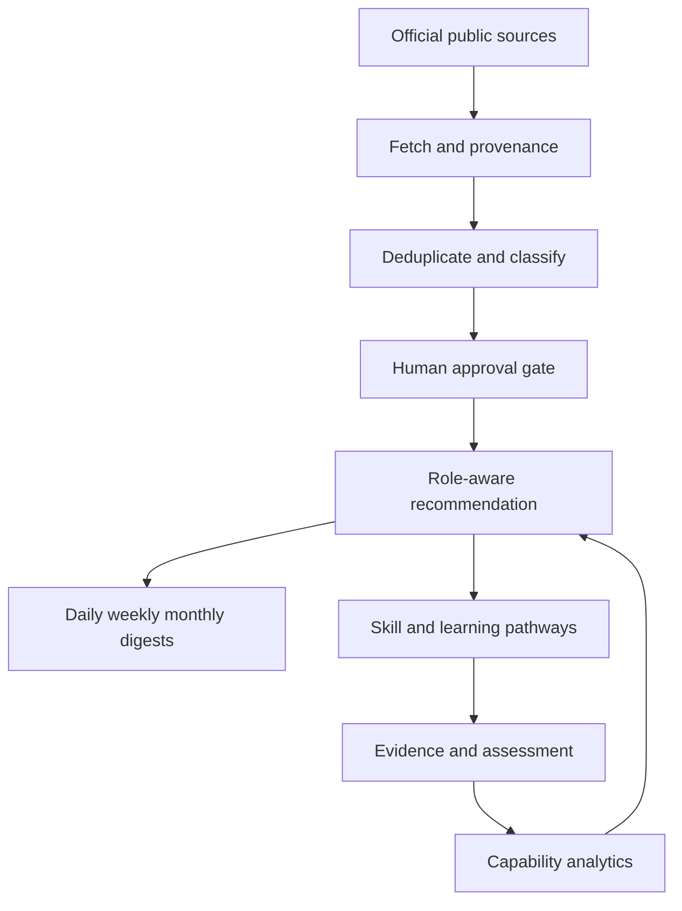

# Architecture and operating model

## Purpose

The hub converts trustworthy institutional information into stakeholder-specific capability outcomes. It is designed as an AspireOS bounded context and can later connect to ReadyFlow AI, identity, CRM/HR, learning, credential and decision-intelligence services through versioned APIs and events.

## Stakeholder value

| Stakeholder | Personalised outcome | Primary measures |
|---|---|---|
| Individual/learner | Relevant updates, skill gaps, learning pathway, evidence portfolio | proficiency gain, completion, evidence quality |
| Faculty/mentor | Curated teaching resources and cohort interventions | learner progress, intervention impact |
| Employer | Role/skill taxonomy and workforce gap intelligence | readiness, internal mobility, time-to-proficiency |
| Institution | Programme relevance and cohort outcomes | coverage, equity, attainment, accreditation evidence |
| Government/policy | Trusted sources and aggregated, privacy-protected insights | reach, inclusion, programme outcomes |
| Administrator | Sources, approvals, taxonomies, compliance and audit | freshness, review SLA, incidents, source health |

## Update orchestration

- Daily: new alerts, regulatory changes, opportunities, deadlines and short actionable learning.
- Weekly: themed synthesis, stakeholder implications, discussion prompts and skill-linked tasks.
- Monthly: trend report, capability movement, programme evaluation, recommended priorities and governance exceptions.
- Every item retains source, canonical URL, publication date, ingestion time, language, resource type, licence, review status and audience mapping.

## Capability loop

1. Diagnose through self, quiz, mentor and work-evidence signals.
2. Compare current level with role/goal target.
3. Recommend licensed/open resources and practical activities.
4. Collect evidence and verified assessment.
5. Reflect, adapt and repeat; never infer high-stakes competence from clicks alone.

Suggested formula: `gap = max(0, target - current)`; weighted readiness is `sum(weight × verified_level) / sum(weight × target) × 100`. Confidence and recency must accompany every score.

## Security and governance

- OIDC/MFA recommended for production; short-lived tokens and least-privilege RBAC.
- Tenant scoping at repository/service layer; PostgreSQL row-level security recommended.
- Consent-bound analytics, purpose limitation, retention schedules, export/delete workflows.
- Allow-listed HTTPS sources, SSRF prevention, size/time limits, malware scanning, sanitisation.
- Human approval, correction, withdrawal and immutable audit trail for published resources.
- No unlicensed full-text republishing; prefer canonical links and licence-aware metadata.
- WCAG 2.2 AA, low-bandwidth delivery, captions/transcripts and Indian-language localisation.
- Map controls to India DPDP Act obligations and applicable organisational policy; obtain legal review before deployment.

## Scaling path

Split ingestion, recommendation, notification and analytics into workers when load requires it. Use an event broker with idempotency keys, object storage for permitted assets, OpenSearch for discovery, a feature store/vector index only where justified, CDN caching, observability via OpenTelemetry, and blue/green deployment. Keep rule-based recommendations as an explainable baseline before introducing ML.

